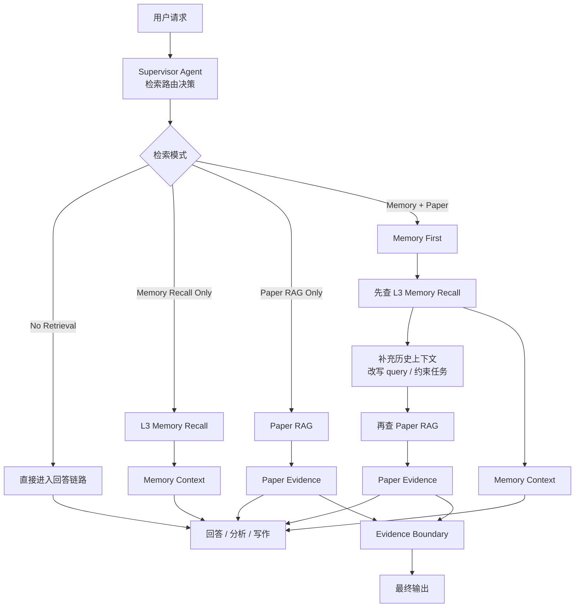

# 智能研究助手Agent：L3 语义记忆召回设计 V2

## 1. 设计动机

当前 `L3` 已经承担了长期研究沉淀职责，但如果只保留文件落盘和关键词检索能力，会有两个明显问题：

- 研究记忆可以被保存，但难以被高质量召回
- 同义表达、主题延续、隐式历史关联难以命中

因此，`L3` 需要补一条独立的 `semantic/hybrid memory recall` 链路。

这里最关键的设计原则是：

- `L3 recall` 和论文 `RAG` 必须解耦
- `L3 recall` 提供的是历史研究上下文
- 论文 `RAG` 提供的是当前回答证据

不能把两者无差别混成一个检索池，否则会破坏系统的证据边界。

## 2. 为什么不能直接把 `L3` 并入论文 RAG

如果把 `L3` 和记忆文件切块后直接并入论文检索库，会带来两个风险：

1. 历史记忆和论文证据混在同一个排序池中
2. 系统自己写出的历史总结可能在排序上压过论文原文

这样会导致：

- 模型把“自己过去写下来的结论”当成“当前外部证据”
- `Evidence Boundary` 变脏
- grounded answer 的可信度下降

所以最合理的路线不是“一个大 RAG 库”，而是：

- `Paper RAG`
- `Memory Recall`

由 `Supervisor` 在上层决定走哪条链路，必要时再做双检索协同。

## 3. 总体方案

系统增加一条独立于论文 `RAG` 的 `L3 Semantic/Hybrid Memory Recall` 链路。

整体分成两套检索子系统：

### 3.1 `Paper RAG`

职责：

- 检索论文库
- 提供当前任务证据
- 参与 `Evidence Boundary`

适合回答：

- 论文方法细节
- 论文对比
- 引用与证据追溯
- grounded answer

### 3.2 `Memory Recall`

职责：

- 检索 `L3` 沉淀的长期研究记忆
- 提供历史研究上下文
- 支撑连续研究任务

适合回答：

- 我们之前讨论过什么
- 最近这个方向进展到哪了
- 延续昨天的问题继续分析
- 最近几天关于某主题有什么结论

## 4. `L3` 的索引对象

`L3` 不应继续以“整篇每日记忆文件”为最小检索单位，而应以 `memory entry` 为基本索引单元。

每条 `memory entry` 建议包含：

- `entryId`
- `date`
- `topic`
- `sourceSessionId`
- `turnRange`
- `summary`
- `keyFindings`
- `openQuestions`
- `text`

这样做的好处是：

- 结构边界清晰
- 便于 embedding
- 便于 recency 和 topic boost
- 后续便于 merge/update

## 5. `L3` 的检索策略

`L3` 建议采用独立的 hybrid recall：

- `keyword retrieval`
- `vector similarity`
- `hybrid merge`

但排序信号不应完全复用论文 `RAG`，而应加入记忆特有信号：

- `semantic score`
- `keyword score`
- `recency boost`
- `topic match boost`

检索排序逻辑可以概括成：

`finalScore = semanticScore + keywordScore + recencyBoost + topicBoost`

其中：

- `semantic score` 负责同义表达与语义延续
- `keyword score` 负责精确命中
- `recency boost` 让最近研究进展更容易排前
- `topic boost` 让当前研究主题下的记忆优先被召回

## 6. 双检索路由策略

不建议默认同时查两个库。  
更合理的做法是让 `Supervisor` 先完成检索路由决策，把请求分成四种模式。

### 6.1 `No Retrieval`

适用场景：

- 纯澄清
- 纯 follow-up
- 短链路对话
- 当前上下文已经足够

### 6.2 `Memory Recall Only`

只查 `L3 memory recall`。

触发信号：

- `之前 / 上次 / 继续 / 延续 / 最近 / 昨天`
- “我们之前讨论过吗”
- “最近这个方向做到了哪里”
- “帮我总结最近几天的研究进展”

这类问题要的不是外部证据，而是历史连续性。

### 6.3 `Paper RAG Only`

只查论文库。

触发信号：

- `论文 / 文献 / 原文 / 引用 / 这篇文章`
- “这个方法的核心机制是什么”
- “A 和 B 两篇论文有什么差异”
- “请给出依据”

这类问题要的是 grounded evidence。

### 6.4 `Memory + Paper`

同时需要历史上下文和外部证据。

适合场景：

- “基于我们之前的结论，继续结合新论文分析”
- “按照当前研究方向，找支持这个思路的论文”
- “延续之前工作，生成一版带证据的报告”

默认推荐顺序不是并行双检索，而是：

`Memory First -> Paper Second`

也就是：

1. 先用 `L3 recall` 召回历史研究上下文
2. 再基于历史上下文改写 query 或约束任务范围
3. 再进入论文 `RAG`

只有在长报告、综述、阶段性总结这类任务里，才适合考虑并行双检索。

## 7. 为什么默认 `Memory First -> Paper Second`

因为 `L3 recall` 可以提供：

- 当前研究主题
- 已有结论
- 未解决问题
- 用户真实关注点

这些信息可以反过来帮助：

- 改写论文检索 query
- 限定论文检索范围
- 提高 paper RAG precision

因此，默认顺序更适合做成：

`用户问题 -> Memory Recall -> enriched query / task frame -> Paper RAG -> 生成`

## 8. 与证据边界的关系

这部分必须明确：

- `Memory Recall` 提供的是历史研究上下文
- `Paper RAG` 提供的是当前回答证据

所以：

- `Memory Recall` 可以进入 prompt
- 但 `Evidence Boundary` 仍然应优先围绕论文证据主链路建立

换句话说：

- 历史记忆帮助模型理解“当前正在做什么”
- 论文证据帮助模型回答“当前为什么这么说”

## 9. 一张图看懂

## 10. 最终建议

一句话压缩就是：

`L3 不应直接并入论文 RAG，而应补一条独立的 semantic/hybrid memory recall 链路，由 Supervisor 根据任务意图在 No Retrieval、Memory Recall Only、Paper RAG Only、Memory + Paper 四种模式之间做路由决策；其中双检索默认采用 Memory First -> Paper Second，以历史研究上下文辅助论文证据检索，同时保持 Evidence Boundary 仍以论文证据为主。`
