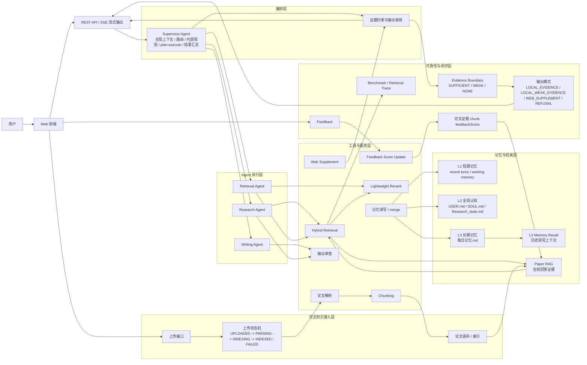
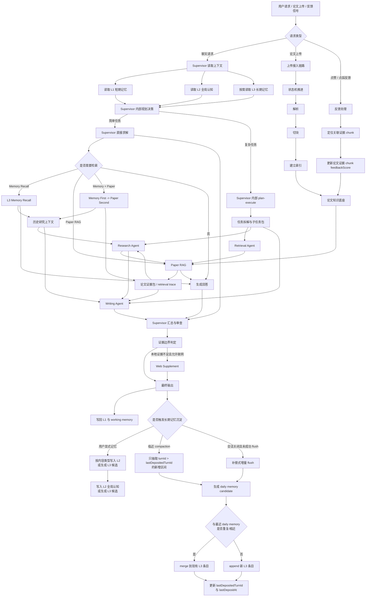
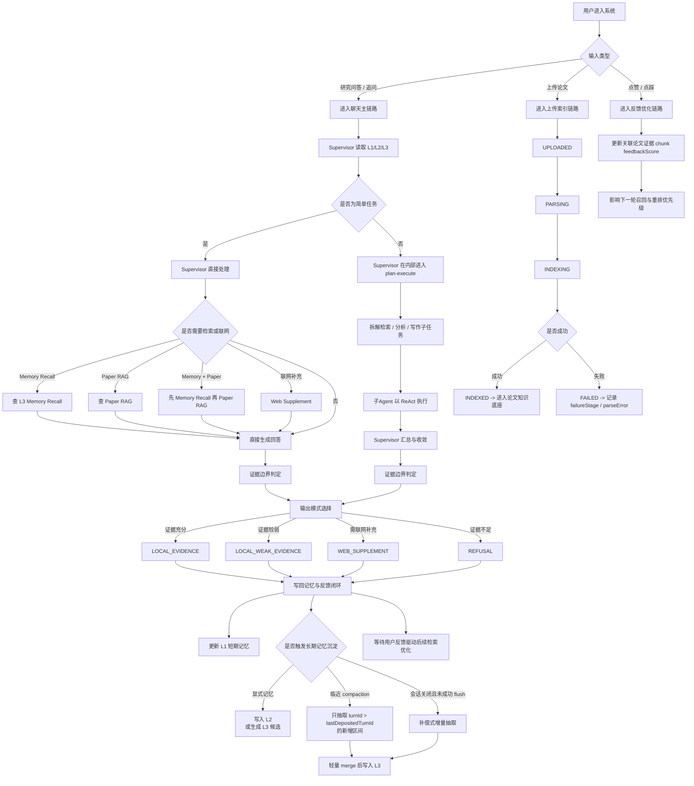
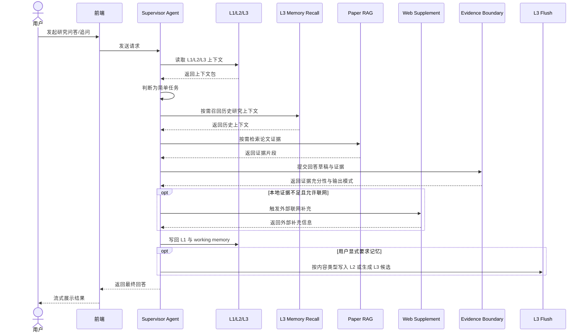
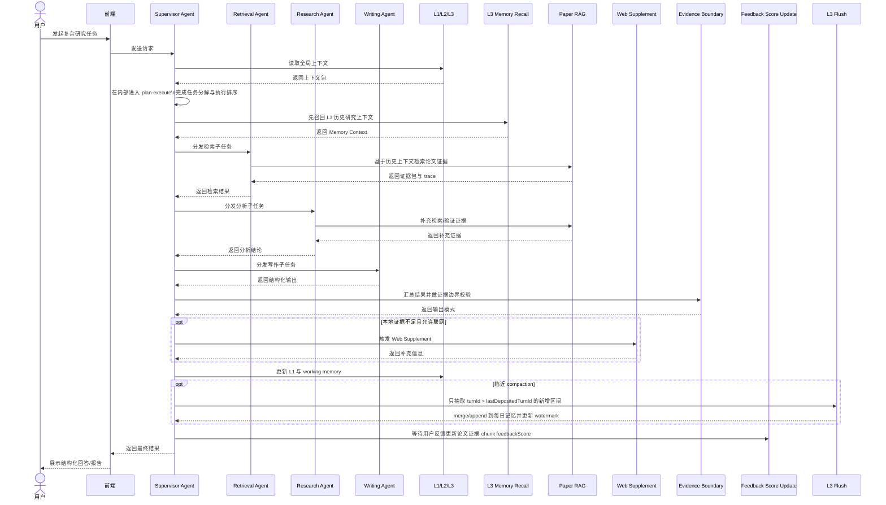
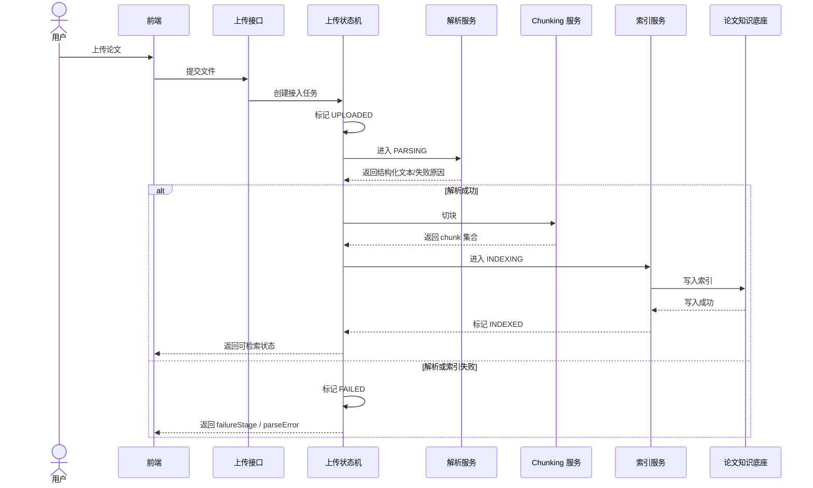
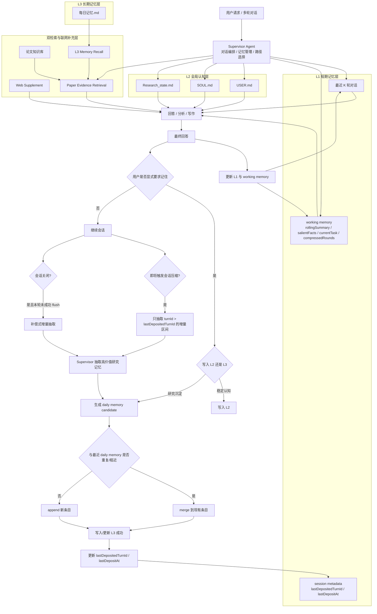
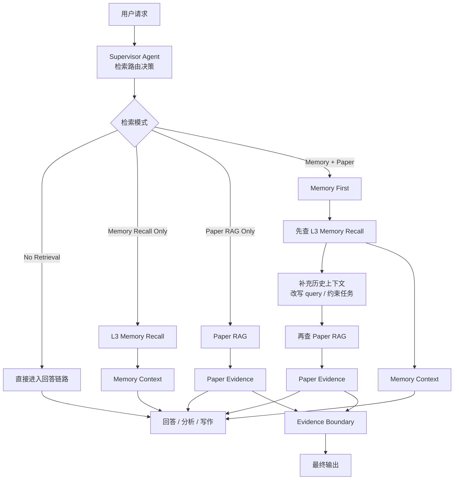

# 智能研究助手Agent：架构图谱 V2

这份图谱文档服务于两类目标：

- 帮助自己快速建立对系统整体脉络的理解
- 帮助秋招面试时用一套自洽、稳定、可追问的方式讲清项目

全文统一采用 V2 口径：

- `Supervisor Agent` 主导的自治多Agent协作架构
- 简单任务由 `Supervisor` 直接处理
- 复杂任务由 `Supervisor` 在内部进入 `plan-execute`
- 专用子Agent在职责域内以 `ReAct` 为主要执行范式
- 上下文工程采用 `L1 / L2 / L3 + 双检索`
- 长期记忆采用“显式记忆 + compaction 前增量 flush + session close 补偿 flush”
- 可靠性围绕证据边界、拒答/降级、上传状态机、benchmark、联网补充与反馈驱动检索优化展开

## 1. 系统总体架构图

## 2. 功能模块之间的数据流图

## 3. 业务逻辑图

## 4. 时序图一：简单研究问答

## 5. 时序图二：复杂任务 plan-execute

## 6. 时序图三：论文上传与索引

## 7. 记忆系统架构图

## 8. 双检索路由图

这张图表达的核心是：

- `L3 recall` 和论文 `RAG` 是两条独立检索链
- `L3 recall` 负责历史研究上下文
- 论文 `RAG` 负责当前回答证据
- 双检索默认采用 `Memory First -> Paper Second`

## 9. 图谱解读建议

如果是自己复习，推荐按下面顺序看：

1. 先看“系统总体架构图”，建立六层视图
2. 再看“数据流图”，理解上下文、检索、记忆、反馈如何流动
3. 再看“业务逻辑图”，理解简单任务与复杂任务的分流
4. 再看“记忆系统架构图”，把 L1/L2/L3 的写入边界彻底看清
5. 再看“双检索路由图”，理解 `L3 recall`、`paper RAG` 与 `Web Supplement` 的关系
6. 最后看三张时序图，把聊天、复杂任务、论文上传三条关键链路串起来

如果是面试讲项目，推荐按下面顺序讲：

1. 先用总体架构图介绍 `Supervisor + 多Agent`
2. 再用业务逻辑图讲 `简单任务直解 / 复杂任务 plan-execute`
3. 再用记忆系统架构图讲 `L1/L2/L3 + 双检索` 和事件触发式长期沉淀
4. 再用双检索路由图讲 `L3 recall` 与 `paper RAG` 的边界
5. 再用时序图讲一条简单链路和一条复杂链路
6. 最后补充上传状态机、证据边界、联网补充与 feedback 驱动检索优化，体现系统工程化能力
