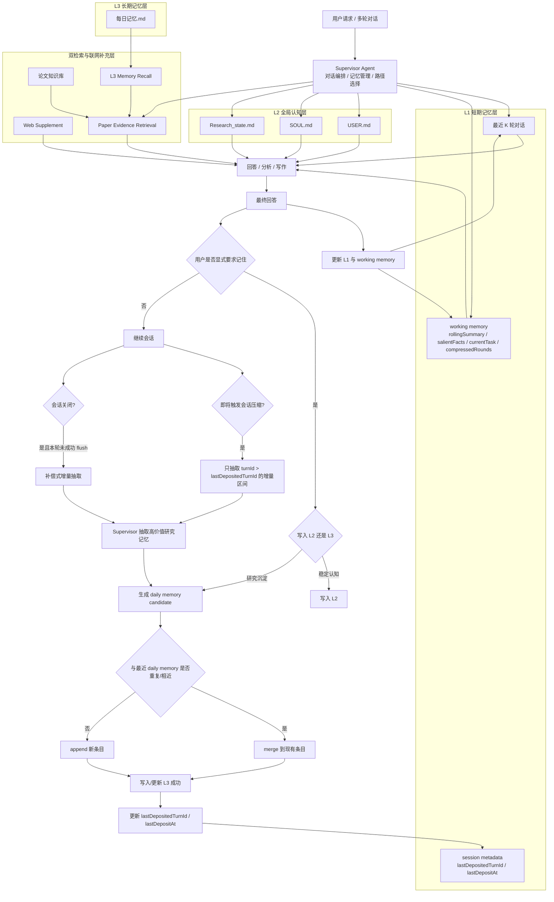

# 智能研究助手Agent：记忆系统设计 V2

## 1. 设计目标

这套记忆系统不是为了把所有聊天历史都塞进上下文，而是为了解决科研场景里的四个核心问题：

- 保持当前会话的连续性
- 保持跨会话的稳定认知
- 把高价值研究过程沉淀成长期资产
- 避免长期记忆重复、失控和污染

因此，系统采用 `L1 / L2 / L3 + 双检索` 的分层方案：

- `L1` 负责当前会话连续性
- `L2` 负责稳定全局认知
- `L3` 负责长期研究沉淀
- `L3 Memory Recall` 负责历史研究上下文召回
- `Paper RAG` 负责当前任务的论文证据召回

这里最重要的边界是：

- `Memory` 回答的是“系统应该长期保留什么”
- `Retrieval` 回答的是“当前任务需要临时召回什么上下文或证据”

## 2. 分层设计

### 2.1 `L1`：短期记忆

`L1` 只服务当前会话，核心目标是保持连续追问、当前任务状态和上下文压缩后的可恢复性。

它包含两部分：

- 最近 `K` 轮对话
- 结构化 `working memory`

`working memory` 重点维护：

- `rollingSummary`
- `salientFacts`
- `currentTask`
- `compressedRounds`

此外，`L1` 还维护会话级元数据：

- `lastDepositedTurnId`
- `lastDepositAt`

这两个字段不是给模型回答问题用的，而是给长期记忆沉淀用的，用来标记：

- 哪一段对话已经被写入 `L3`
- 下一次 flush 只应该处理哪一段增量内容

### 2.2 `L2`：全局认知

`L2` 用于存放跨会话、长期稳定、需要持续影响系统行为的认知信息。

核心载体为：

- `USER.md`
- `SOUL.md`
- `Research_state.md`

三者分别承担：

- `USER.md`：用户偏好、用户背景、长期研究兴趣
- `SOUL.md`：系统行为原则、表达边界、风格约束
- `Research_state.md`：当前研究阶段、研究路线、近期重点

`L2` 不存聊天流水，也不存短期过程性笔记。它本质上是系统的稳定认知层。

### 2.3 `L3`：长期记忆

`L3` 用于沉淀研究过程中的长期价值信息，核心载体为 `每日记忆.md`。

它记录的不是原始完整对话，而是抽取后的高价值研究条目，例如：

- 当前研究主题
- 本轮关键问题
- 阶段性结论
- 关键证据或依据
- 待跟进问题

所以 `L3` 更接近“研究沉淀层”，而不是“聊天备份层”。

## 3. 写入机制

### 3.1 显式记忆写入

当用户明确提出“记住这个”时，由 `Supervisor Agent` 先做内容类型判断，再决定写入目标：

- 稳定偏好、长期事实、系统约束、研究阶段状态 -> 写入 `L2`
- 研究过程、阶段结论、待跟进问题、研究经验 -> 写入 `L3`

这条链路的特点是：

- 明确
- 立即生效
- 可控

### 3.2 会话压缩前的增量 flush

当会话上下文即将触发 compaction 时，不对整个 `L1` 全量重扫，而是由 `Supervisor Agent` 做一次增量式长期记忆沉淀。

它的核心流程是：

1. 找出 `turnId > lastDepositedTurnId` 的新增对话区间
2. 只对这段增量内容做抽取
3. 生成 `daily memory candidate`
4. 写入或合并到 `L3`
5. 更新 `lastDepositedTurnId` 与 `lastDepositAt`

这条机制的目标不是“压缩上下文”，而是“在压缩前把值得长期保留的研究信息外化出来”。

### 3.3 会话关闭时的补偿式 flush

会话关闭时也会触发一次长期记忆沉淀，但它不是固定重复执行，而是补偿机制。

只有在当前会话尚未完成成功 flush 时，才会执行：

- 基于 `lastDepositedTurnId` 的增量抽取
- 把尚未沉淀的新内容写入 `L3`

因此：

- `compaction flush` 是主链路
- `session close flush` 是补偿链路

## 4. 避免重复沉淀的关键机制

### 4.1 `lastDepositedTurnId`

这是整套设计的核心边界。

每次成功写入 `L3` 后，系统会记录：

- `lastDepositedTurnId = 当前已沉淀的最大 turnId`

下一次再触发长期记忆沉淀时，只处理：

- `turnId > lastDepositedTurnId`

这样就避免了 compaction 前反复扫描同一批对话内容。

### 4.2 轻量 merge

即使做了增量抽取，也可能发生另一类重复：

- 两轮不同的对话
- 实际沉淀出同一个主题或同一条结论

因此在写入 `L3` 前，还要做一层轻量 merge：

- 如果与当日最近一条 daily memory 高度相近，则 merge
- 否则 append 新条目

它解决的是：

- 机械重复
- 轻微语义重复

## 5. 为什么不直接把完整对话写入 `L3`

如果把 Redis 或 `L1` 中的完整短期记忆直接 dump 到 `每日记忆.md`，会有三个问题：

- `L3` 很快膨胀成聊天流水账
- 后续检索和回顾质量变差
- 长期记忆失去“沉淀”的意义

因此，`L3` 写入必须满足两个原则：

- 不写原始全量对话
- 只写抽取后的高价值研究条目

## 6. 与检索层的关系

`L3` 是长期沉淀层，但并不等于完整的检索层。

在这套设计里：

- `L3` 负责把高价值研究信息沉淀下来
- `L3 Memory Recall` 负责按需召回历史研究上下文
- `Paper RAG` 负责按需召回论文证据
- `Web Supplement` 负责在本地证据不足时补充外部信息

因此它们是协同关系，而不是替代关系。

## 7. 一张图看懂

## 8. 最终总结

这套新版记忆系统的关键，不是把长期记忆做成一个“什么都存”的大仓库，而是通过分层、事件触发、增量抽取和轻量 merge，把长期研究沉淀真正做成可控、可复用、可扩展的系统能力。

一句话压缩就是：

`L1 负责当前会话连续性，L2 负责稳定全局认知，L3 负责长期研究沉淀；长期记忆写入由显式记忆、compaction 前增量 flush 和会话关闭补偿 flush 触发，并通过 lastDepositedTurnId 与轻量 merge 避免重复沉淀。`
